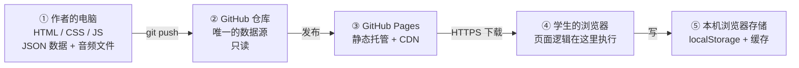

# 技术方案 —— 英语学习网页工具

> **项目**：英语学习网页工具（面向本机构学生的内部学习工具）
> **仓库**：https://github.com/XingHo-VibeCoding/mirroriceee
> **文档阶段**：Day 5 · 第 1 周｜技术方案（技术路线 + 数据流）
> **日期**：2026-09-21
> **依据**：`PRD.md`（Day 4）+ Day 5 的范围简化决定（见 1.1）
> **本文档给谁看**：自己（写代码时的依据）、老师与同学（验收时的对照物）、AI（写代码时的输入）

---

## 目录

- [〇、一句话说明](#〇一句话说明)
- [一、本方案的前提](#一本方案的前提)
- [二、技术路线](#二技术路线) ← **这一节回答「用什么做、为什么」**
- [三、内容结构与文件放哪](#三内容结构与文件放哪)
- [四、数据流](#四数据流) ← **这一节回答「数据从哪来、到哪去」**
- [五、本期不做 / 将来可加](#五本期不做--将来可加)
- [六、待同步清单](#六待同步清单)
- [修订记录](#修订记录)

---

## 〇、一句话说明

**数据全部来自仓库里的静态文件，页面逻辑全部跑在学生的浏览器里，没有任何数据回传服务器——因为本期没有服务器。**

本文档回答的正是这个链路的每一段：数据从哪来（第二节 2.3）、经过谁的手（第三节）、到哪去（数据流图见「数据流」一节）。

---

## 一、本方案的前提

### 1.1 Day 5 的范围简化（本方案与 PRD 的差异来源）

**Day 5 决定：移除验证码，网页改为纯公开访问——任何人都可以听音频、看词表。**

依据（决定人：项目作者本人）：

1. 内容是教材音频与课程词表，**不需要保密**，同类内容在网上随处可见；
2. 门禁本来只是「防路人」级别——`PRD.md` 3.4 已如实承认它挡不住按 F12 的人；
3. 把精力聚焦在**内容开发**上，加密/鉴权环节后期再议。

**⚠️ 由此产生的一处已知不一致（**明示，不藏**）**：
本决定落地时，`PRD.md` 尚未同步修改，其中 F1「验证码进入」仍写作 P0 / MVP 必须项，`PRD.md` 第六节 V1–V6 六条验收标准仍在。**两份文档此刻不一致。** 待同步的具体位置已在**本文档第六节**逐条列出（共 11 处），计划在 Day 6 一次性改完。

**本方案一律以「无门禁」为前提**，不以 PRD 的 F1 为准。

### 1.2 简化之后：哪些问题消失了，哪些没变

| | 项 |
|---|---|
| **消失** | ① `PRD.md` F1-5 遗留的难题「验证码怎么做到不以明文出现在公开仓库」——题没了；② Day 4 交接的三道待解题**减少一道**（原三道，现两道） |
| **消失** | ③ 入口页（输码页）及其相关的 6 条验收标准（V1–V6） |
| **没变** | 复读机（F2）与首页骨架（F3）的全部需求与验收标准，**一条不动** |
| **没变** | 「本期不做后端 / 数据库」的结论不变（原因已换，见 1.3） |
| **新增的账** | 无门禁 = **链接一旦外传即完全失控**，没有任何刹车。这是主动接受的代价，不是遗漏 |

### 1.3 本方案遵守的边界

1. **不借技术选型扩大范围。** 本方案只在「纯前端静态网页」这个前提下选工具；凡涉及新架构（后端、账号、数据库）的构想，一律进**第五节**的「将来可加」，不在本期实现。
2. **不实现 PRD 未要求的能力。** 例如离线（PWA）、搜索、收藏，PRD 没有要求，本方案不引入。
3. **优先选「作者本人能看懂、能调试」的方案。** 作者是本项目的唯一维护者，且处于学习阶段——可维护性优先于工程上的「先进」。

---

## 二、技术路线

> **技术路线（一行）**：
> **HTML + CSS + 原生 JavaScript；内容用静态 JSON + 音频文件；托管在 GitHub Pages；全部跑在学生的浏览器里，没有服务器、没有数据库。**

下面逐项说明「选什么、为什么选它、暂时不选什么、代价是什么」。

### 2.1 前端：HTML + CSS + 原生 JavaScript（不引入框架）

| 项 | 内容 |
|---|---|
| **选** | HTML5 / CSS3 / 原生 JavaScript（ES6+），不用框架、不用构建工具 |
| **为什么** | ① 本项目只有 3 个页面、状态极简（当前播哪一句），框架解决的是「页面多、状态乱」，这个前提下用不上；② 引入框架就要引入 Node + npm + 打包流程，而部署目标是静态托管——结果是「改一个错别字也要跑一遍构建」，净增负担；③ **作者能直接读懂、按 F12 当场调试**，这是本项目最重要的一条可维护性 |
| **代价（如实记）** | 原生 JS 要多写一些重复代码（比如 3 个页面各自的初始化）。以本项目规模，这点代码量远小于工具链的引入成本 |
| **暂时不选** | React / Vue / Svelte —— 触发条件：页面数量与状态复杂度明显上升时重评 |

### 2.2 托管：GitHub Pages

| 项 | 内容 |
|---|---|
| **选** | GitHub Pages（仓库已公开，可免费使用），预计地址 `https://xingho-vibecoding.github.io/mirroriceee/` |
| **为什么** | ① 零成本、零运维；② 与代码仓库天然同一处——`push` 即发布，不需要另一套部署流程；③ 自带 HTTPS 与 CDN，手机访问没问题 |
| **代价** | ① 只发文件、**不跑逻辑**——这正是「本期没有后端」的具体含义；② 发布有几十秒延迟；③ 需要在仓库 Settings 里手工开启一次（**人工操作，不由 AI 代做**） |
| **暂时不选** | Vercel / Netlify（能力更强，但本项目用不到）、自建服务器（要花钱、要运维） |

### 2.3 内容数据：静态 JSON + 音频文件（顶替「数据库」的位置）

PRD 里「数据库」这个角色，在本期由**仓库里的静态文件**担任。

| 文件 | 装什么 |
|---|---|
| `data/materials.json` | 素材清单（有哪些课文、各自标题与音频路径） |
| `data/segments.json` | **句子与音频时间戳的对齐数据**（哪一句从第几秒到第几秒） |
| `assets/audio/*.mp3` | 音频文件本体 |

**⚠️ 关键限制（本方案最重要的一条约束）：这些文件只能读，不能写。**

它带来两个后果，都很具体：

1. **改内容 = 改文件 + 重新 `push`。** 这对我们不是问题——内容本来就只有作者一个人改。
2. **学生端产生的任何数据都写不回来。** 例如「这个词我已掌握」这类标记，只能存在学生本机浏览器里（`localStorage`）：**换手机就没了，同学之间也互不相见**。本期接受这一限制（对应 `PRD.md` F4 排在 MVP 之后）。

**为什么不用「把内容写死在 HTML 里」**：素材会换、会加。JSON 让「换素材」等于「换一个文件」，不用动代码——这是今天多花的十分钟，换以后每次都省事。

### 2.4 音频播放：一个 `<audio>` 对象 + 时间戳定位

| 项 | 内容 |
|---|---|
| **选** | 浏览器原生音频能力（`new Audio()` / `<audio>`），用 `currentTime` 跳到某句的起点，用 `timeupdate` 事件监听是否到达该句终点 |
| **为什么** | 需求是「分段点播」，本质是「在一整段音频上按时间戳切窗口」，原生能力即可完成，不需要任何库 |
| **对应需求** | 点句即播（R1）、连点 3 次不叠音（R2）、切句立即停旧播新（R3）、正在播的句子高亮（R4）、单句重复（R5）、切素材停旧的（R7）、停止按钮（B4） |
| **实现要点** | ① 切句/切素材时**先 `pause()` 再改状态**，避免两段声音叠加；② 高亮随 `timeupdate` 更新；③ 单句重复**不能用 `loop` 属性**（那是整段循环），要在到达终点后把 `currentTime` 拨回起点再播；④ 按钮点击区域 `min-width/min-height: 44px`（R9） |
| **暂时不选** | 第三方播放器库 —— 触发条件：出现原生能力覆盖不了的需求（如波形图、变速不变调） |

### 2.5 移动端适配：响应式 + 真机优先

PRD 明确「移动端适配是刚需，不是加分项」（依据：批改网差评）。做法：

- `viewport` meta（现有 `index.html` 已有）；
- CSS 用 Flex / Grid + 媒体查询，目标 **375px 与 390px 宽不出现横向滚动**（G1）；
- 手机上**没有 hover**，按钮状态用 `:active`，不要依赖鼠标悬停；
- **移动端相关验收一律用真机**，不许用「电脑上缩窗口」代替（G1 / G2 / G5 已写明）。

### 2.6 ★ 待解题一：iOS Safari 的音频播放限制

**问题**：iPhone 的 Safari **不允许没有用户手势的自动播放**，且音频需要先被「解锁」。

| 项 | 内容 |
|---|---|
| **选** | ① **首次播放必须由用户点击触发**——本项目天然满足，因为「点某一句」本身就是点击；② **全程复用同一个音频对象**，不每次新建；③ 切句时**改 `currentTime` 而不是换 `src`**；④ 「一整段音频 + 时间戳」而非「每句一个文件」 |
| **为什么** | 换 `src` 在 iOS 上有较高概率重新触发播放限制；复用同一对象、只改播放位置，等于「从头到尾只有一次真正的加载」，最稳 |
| **暂时不选** | 每句切成独立 mp3 文件 —— 代价：① 文件数量爆炸（一课几十个文件）；② iOS 上频繁换 `src` 更容易出问题；③ 请求数增多，直接撞 G2「4G 下 3 秒可点播放」 |
| **验收关联** | G5（iOS Safari 上音频能真实出声） |

### 2.7 ★ 待解题二：句子与音频的「对齐数据」怎么来

**这是 Day 4 交接过来的第一道题**（`PRD.md` 4.3 留的问题），也是 F2-2「分段点播」能否成立的前提。

| 项 | 内容 |
|---|---|
| **选** | **手工标注**。用播放器逐句听，记下每句的起止秒数，手写进 `data/segments.json` |
| **为什么** | ① 本期素材只有 1–2 条，句子数有限，手工完全可控；② **结果可核对**——每句都能听一遍确认，工具生成的结果反而还要再抽检一遍，多一道工序；③ **不引入工具链**——自动对齐工具需要 Python 环境和模型下载，对「先把功能跑通」是纯负担；④ 开发期用假素材时，时间戳本来就是自己造的 |
| **数据结构** | `{"materialId": "...", "segments": [{"idx": 0, "start": 0.0, "end": 3.2, "text": "..."}]}` |
| **暂时不选** | 工具自动生成（强制对齐 / forced alignment，如 aeneas、带时间戳的语音识别）—— **触发条件：素材条数上到 10 条以上**，手工的时间成本随条数线性增长，工具的「一次性投入」才开始划算。届时需抽检对齐精度 |
| **验收关联** | F2-2；工作量风险见 `PRD.md` 7.2 风险 3 |

### 2.8 素材体积与加载（对应 R8 / G2）

- **单条音频不超过 5MB**（R8，暂定值，真素材到位后按实际音质需求复测）；
- **按需加载**：首屏只请求素材清单（`materials.json` 很小），点开某条素材才请求音频 —— **不预加载全部素材**；
- **需要注意的取舍（如实记）**：因为采用「一整段音频 + 时间戳」的方案，**点开某一课就等于下载整段音频**。5MB 这个阈值的来源正是它。若将来单条素材必须更大，就要重评方案（按句切文件或流式加载）；
- 假素材阶段先跑通功能，**真素材到位后必须按 G2 重测**。

### 2.9 验证码：本期移除（原 Day 4 待解题三，已随 1.1 消失）

- 本方案**不含任何门禁机制**，也没有入口页。
- 连带消失的还有 `PRD.md` F1-5 那道难题（「验证码怎么做到不以明文进入公开仓库」）——没有码，就没有这个问题。
- **留一句给将来**：若日后要加回门禁，最轻的做法是「一道总口令」；因为仓库是公开的，**口令必须以哈希形式存放，不能存明文**。这条留在**第五节**的「将来可加」。

---

## 三、内容结构与文件放哪

以下是**写代码阶段的目标结构**（今天只写文档，**不建任何文件**）：

```
/
├── index.html              首页骨架（三个板块入口 + 状态标识）     ← F3
├── reader.html             文本跟读（复读机）★ MVP 核心            ← F2
├── vocab.html              词汇速记                                ← F4（MVP 后）
├── writing.html            作文模板                                ← F5（MVP 后）
│
├── assets/
│   ├── css/style.css       全站样式（含 375/390px 适配与 44px 触控）
│   ├── js/
│   │   ├── player.js       分段点播核心（audio 对象 + 时间戳 + 高亮）
│   │   └── app.js          页面初始化与导航
│   └── audio/              音频素材（*假素材先行，真素材到位后替换*）
│
└── data/
    ├── materials.json      素材清单
    ├── segments.json       句子↔时间戳对齐数据
    └── words.json          词表（MVP 后）
```

**四条结构纪律**

1. **内容与代码分离**：素材一律放 `data/` 与 `assets/audio/`，**不写进 HTML**。换素材不碰代码。
2. **不引入班级维度**：本方案的内容结构**不含「这条素材属于哪个班」这个字段**（因为已无门禁）。
   ⚠️ 若将来要「按班分内容」，需给每条素材补一个班级字段并重排目录——这是一笔真实的重构成本，记在**第五节**。
3. **文档与代码同处一仓**：`PRD.md` / `research.md` / `TECH_DESIGN.md` 与代码在同一仓库，方便老师同学一并对照。
4. **`README` 之类文件暂不新建**：清单没要求，不额外建文件。

---

## 四、数据流

> **一句话：数据从「作者的电脑」出发，经仓库托管，下载到「学生的浏览器」里被读出来用——全程只往一个方向走，没有回程。**

这就是今天那句主题的完整答案。下面先给图，再讲图里的每一段。

### 4.1 数据流图



**同一条链路的文字版**（编辑器不渲染上面那张图时，看这一段）：

```
① 作者的电脑（本地文件）
        |
        |  git push
        v
② GitHub 仓库（唯一的数据源，只读）
        |
        |  发布
        v
③ GitHub Pages（静态托管 + CDN）
        |
        |  HTTPS 下载
        v
④ 学生的浏览器（页面逻辑在这里执行）
        |
        |  写
        v
⑤ 本机浏览器存储（localStorage + 缓存）
```

### 4.2 每一段在传什么

| 段 | 谁在动 | 传的是什么 | 方向 |
|---|---|---|---|
| ① → ② | **作者（你）** | 页面代码、`data/*.json`、音频文件 | 你有网时手动 `push` |
| ② → ③ | GitHub | 同样的文件，原样复制一份对外提供 | 发布时一次性 |
| ③ → ④ | **学生打开网址** | `index.html`、CSS、JS、素材清单与时间戳、点开的那条音频 | **只往下走** |
| ④ → ⑤ | 学生的浏览器 | 他本机的标记（如「已掌握」） | 只写进他自己那台机器 |
| ⑤ → ② | —— | **不存在** | 本期没有后端 |

### 4.3 三笔数据，各自的起点和终点

| 数据 | 从哪来 | 到哪去 | 谁能改 |
|---|---|---|---|
| **课程内容**（音频、词表、模板） | 你的电脑 | 学生的浏览器 | 只有你，改完要重新 `push` |
| **配置数据**（素材清单、句子↔时间戳） | 你的电脑 | 学生的浏览器 | 只有你 |
| **学生产生的数据**（「已掌握」标记） | 学生的操作 | **他自己那台机器** | 只有他，而且换设备就没了 |

### 4.4 这张图想说的三件事

1. **只有一个方向：你 → 学生。** 学生那边产生的东西**永远出不来**——图上没有从 ⑤ 回到 ② 的那条线。这就是「跨设备记住」「按人撤销授权」这类需求在本期做不到的根本原因：**不是不想做，是图上没有那条线。**
2. **② 是唯一的数据源，而它只能由 ① 更新。** 所以「改内容」= 改文件 + 重新 `push`，没有第二个入口。
3. **⑤ 里的东西随时会蒸发。** 它包含 `localStorage` 和浏览器的 HTTP 缓存（音频下载过就会被缓存，第二次打开更快）。但**这不等于「离线可用」**——缓存随时可能被清掉，清掉之后必须联网才能恢复。

---

## 五、本期不做 / 将来可加

### 5.1 本期不做（沿用 `PRD.md` 第五节，本处仅记与本次简化相关的条目）

| 项 | 理由 |
|---|---|
| 后端 / 服务器 / 数据库 | 无上传、无门禁、无按人管理，纯静态托管即可 |
| **验证码 / 任何门禁**（Day 5 新增） | 见 1.1；内容是公开素材，不需要保密 |
| 学生上传录音 / 视频 | 需要存储与鉴权，后端随之而来 |
| AI 批改 / 知识库接入 | 需要 LLM API（费用 + 后端） |
| 小程序 / App | 本期先把网页做扎实 |
| 吸睛主界面 | 功能先跑通，再谈好看 |

### 5.2 将来可加（每条都写清触发条件，不做无理由的预留）

| 想加的东西 | 什么条件下加 | 加它要付什么 |
|---|---|---|
| **门禁 / 验证码** | 需要让内容「只给本班用」，或需要**按班分内容** | 只加「一道总口令」很轻；**按班分内容**则要给每条素材补班级字段、重排内容结构 |
| **离线使用（PWA）** | 有学生实际反馈「网络差、听不了」 | Service Worker + 缓存策略；首次访问需下载音频（流量），且要重评 R8 / G2 |
| **后端 + 账号** | 需要「跨设备记住」（如 F4 的「已掌握」标记换手机还能看见） | 产品从「一个网页」变成「一套小系统」，运维与成本同时上升 |
| 工具自动生成对齐数据 | 素材条数 ≥ 10 条 | 需 Python 环境与模型，产出需抽检 |

---

## 六、待同步清单

> 本方案依据 Day 5 的简化决定（移除验证码），与现有文档存在**已知不一致**。以下是需要同步的全部位置，**计划 Day 6 一次性处理，今天不改**。

### 6.1 `PRD.md`（11 处）

| # | 位置 | 现在写的 | 要改成 |
|---|---|---|---|
| 1 | 4.2 整节 | F1 验证码进入（F1-1～F1-5，6 条需求） | 整节删除；若保留痕迹，改为「本期不做」的说明 |
| 2 | 4.1 范围总览表 | F1 行（P0 / MVP 必须） | 删除该行 |
| 3 | 4.7 MVP 边界 | 「MVP = F1 + F2 + F3」 | 「MVP = F2 + F3」 |
| 4 | 6.2 整节 | V1–V6 六条验收标准 | 整节作废 |
| 5 | 6.1 G4 | 「不出现明文的验证码、学生姓名、老师联系方式」 | 去掉「验证码」三字，保留后两项 |
| 6 | 6.6 判定行 | 「全部 G / V / H / R / B 条目通过」 | 去掉 V 类 |
| 7 | 3.4 整节 | 验证码机制表 + 已知限制 | 重写为「公开访问」 |
| 8 | 3.2 定位表 | 「老师发码、学生凭码进入的内部工具」 | 改为公开访问的表述 |
| 9 | 第五节第 4 行 | 「不做后端」的理由（含按班管理的论证） | 理由需重述（不再依赖门禁） |
| 10 | 附录 决策台账 | Day 4 第 1 条「本期不做后台」 | 补一条 Day 5 的翻案/简化记录 |
| 11 | 修订记录 | 仅 v1.0 | 追加 v1.1（Day 5 移除验证码） |

### 6.2 `research.md`（2 处，更早的文档，可只加标注）

| # | 位置 | 说明 |
|---|---|---|
| 1 | 第三节「分发方式」 | 写有「由老师发放验证码」 |
| 2 | 第七节「本期要做」 | 写有「验证码进入」一行 |

> 处理口径：`PRD.md` 文末已声明「如与 `research.md` 冲突，以 PRD 为准」；因此 `research.md` 可只加一句指向本方案的标注，不必逐条改。

---

## 修订记录

| 版本 | 日期 | 阶段 | 改了什么 |
|---|---|---|---|
| v1.0 | 2026-09-21 | Day 5 | 首版定稿：前提 + 技术路线（9 小节）+ 内容结构 + **数据流（含数据流图）** + 将来可加 + 待同步清单。同日补入第四节「数据流」，章节由 4 节扩为 5 节，并同步修正全文交叉引用（1.1 / 三.纪律2 / 2.9 / 目录） |
| v0.9 | 2026-09-21 | Day 5 | 首版落盘：前提 + 技术路线（9 小节）+ 内容结构 + 将来可加 + 待同步清单。当时数据流图待补 |
